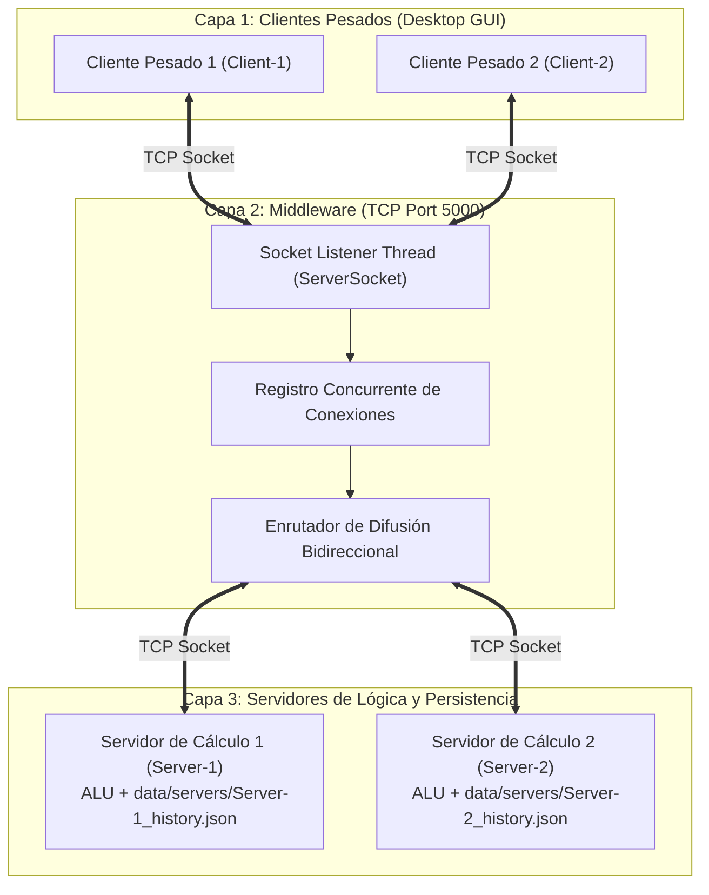

# Calculadora Distribuida de Tres Capas (Sockets TCP)

**Asignatura:** Cómputo Distribuido (9no Semestre — LIDCI21)  
**Institución:** Universidad Panamericana, Campus Ciudad de México  
**Profesor:** Dr. Carlos Pérez Leguízamo  
**Estudiante:** Javier Rangel  

---

## 📋 Descripción del Proyecto

Implementación completa de una **Calculadora Aritmética Distribuida** desarrollada bajo una **arquitectura cliente/servidor de tres capas** estricta, comunicada exclusivamente mediante **Sockets TCP** puros sobre **Java 21/26**.

El sistema desacopla estrictamente:
1. **Capa 1 (Cliente Pesado):** Interfaz gráfica de escritorio nativa (**FlatLaf Swing**) que no delega en navegadores web, con teclado interactivo, monitor de sockets y visualizador de persistencia local.
2. **Capa 2 (Middleware):** Servidor TCP multihilo que identifica roles mediante handshake (`CLIENT` vs `SERVER`), difunde las operaciones emitidas por los clientes a **todos los servidores** conectados, y difunde los resultados recibidos a **todos los clientes** conectados.
3. **Capa 3 (Servidores de Negocio):** Procesos independientes de cálculo aritmético ($+$, $-$, $\times$, $/$, con manejo estricto de división por cero) que persisten cada cómputo de manera no volátil antes de responder al middleware.

---

## 🏛 Arquitectura del Sistema



---

## 🚀 Flujo Obligatorio de Procesamiento

1. Un **Cliente Pesado** genera una solicitud aritmética (e.g. $150 + 250$).
2. El cliente envía la solicitud `CALCULATE_REQ` al **Middleware** y persiste la solicitud en su historial local (`data/clients/<ID>_history.json`).
3. El **Middleware** recibe la petición y la reenvía mediante difusión (*broadcast*) a **todos los servidores conectados** (`Server-1`, `Server-2`, etc.).
4. Cada **Servidor** procesa la operación aritmética mediante su motor `CalculatorEngine`.
5. Cada **Servidor** persiste atómicamente el resultado en su base JSON local (`data/servers/<ID>_history.json`).
6. Cada **Servidor** envía su resultado `CALCULATE_RES` de vuelta al **Middleware**.
7. El **Middleware** reenvía cada resultado recibido a **todos los clientes conectados**.
8. Cada **Cliente** recibe los resultados de todos los servidores, actualiza su tabla en vivo y persiste los resultados recibidos en disco.

---

## 📦 Requisitos de Instalación

- **Java JDK:** Versión 21 o superior (OpenJDK 26 verificado).
- **Apache Maven:** Versión 3.9 o superior.
- **Sistema Operativo:** macOS (Apple Silicon / Intel), Linux o Windows con entorno gráfico.

Para verificar los prerrequisitos en su terminal:
```bash
java -version
javac -version
mvn -version
```

---

## 🛠 Compilación y Empaquetado

Clone el repositorio y ejecute Maven para compilar y generar el *Fat JAR* ejecutable:

```bash
cd /Users/javar/github/unipanam/distributed-computing

# En macOS con Homebrew (si aplica):
export PATH="/opt/homebrew/opt/openjdk/bin:$PATH"

# Compilar y empaquetar
mvn clean package
```

Esto producirá el artefacto ejecutable en:
`target/distributed-computing-1.0.0-jar-with-dependencies.jar`

---

## 🧪 Ejecución de Pruebas Automatizadas

El proyecto incluye una suite de pruebas de integración completa (`DistributedCalculatorTest`) que levanta el Middleware, 2 Servidores y 2 Clientes sobre sockets reales para certificar la difusión, la aritmética, el manejo de división por cero y la persistencia en disco:

```bash
mvn test
```

---

## 💻 Guía de Ejecución Rápida (Demostración para Video)

El repositorio cuenta con scripts preparados para levantar la topología completa requerida por la rúbrica (al menos 2 clientes y 2 servidores):

### Opción A: Clúster Automatizado con un Solo Comando
```bash
# Inicia Middleware, Server-1, Server-2 y abre 2 interfaces gráficas de Cliente
./run-demo-cluster.sh

# Para detener todos los procesos del clúster:
./run-demo-cluster.sh --stop
```

### Opción B: Ejecución Manual en Terminales Separadas

#### Terminal 1: Middleware (Capa 2)
```bash
./run-middleware.sh --port 5000
```

#### Terminal 2: Servidor 1 (Capa 3)
```bash
./run-server.sh --id Server-1 --host localhost --port 5000
```

#### Terminal 3: Servidor 2 (Capa 3)
```bash
./run-server.sh --id Server-2 --host localhost --port 5000
```

#### Terminal 4: Cliente Pesado 1 (Capa 1 - GUI)
```bash
./run-client.sh --id Client-1 --host localhost --port 5000
```

#### Terminal 5: Cliente Pesado 2 (Capa 1 - GUI)
```bash
./run-client.sh --id Client-2 --host localhost --port 5000
```

---

## 📝 Protocolo de Mensajes por Sockets (JSON delimitado por `\n`)

### 1. Handshake de Registro (`REGISTER`)
```json
{"type":"REGISTER","role":"CLIENT","senderId":"Client-1"}
```

### 2. Solicitud Aritmética (`CALCULATE_REQ`)
```json
{
  "type": "CALCULATE_REQ",
  "txId": "TX-346dde99",
  "clientId": "Client-1",
  "operation": "ADD",
  "operandA": 150.0,
  "operandB": 250.0
}
```

### 3. Respuesta de Cálculo (`CALCULATE_RES`)
```json
{
  "type": "CALCULATE_RES",
  "txId": "TX-346dde99",
  "clientId": "Client-1",
  "serverId": "Server-1",
  "operation": "ADD",
  "result": 400.0,
  "status": "SUCCESS"
}
```

---

## 💾 Estructura de Persistencia en Disco

Todos los eventos quedan registrados de manera no volátil en formato JSON:

- **Servidores:** `data/servers/<ServerId>_history.json`
- **Clientes:** `data/clients/<ClientId>_history.json`

---

## 📄 Licencia y Entrega
Proyecto desarrollado para el Primer Parcial de Cómputo Distribuido (11 de Septiembre de 2026), Universidad Panamericana.
